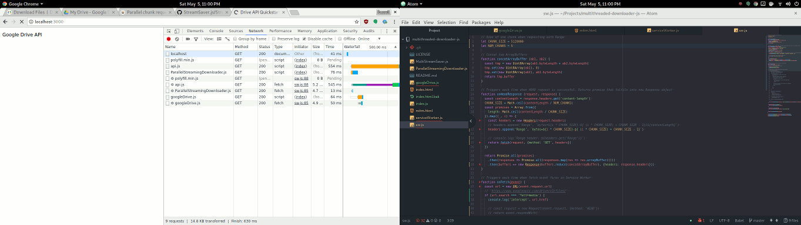

# javascript-multithreaded-downloader
A browser based multithreaded downloader implemented in Javascript.

This project is under development.

A multithreaded downloader will fetch parts of a file using the HTTP Range header and download those pieces in parallel. When the pieces have all been downloaded, the original file shall be reassembled and saved in the browser's Downloads folder.

Goals of this project are:

* The downloader should fetch the file directly from the web browser. No server will be needed to proxy the file.
* The download process should not need any client software to be installed. Nor will a browser plugin be required.
* This project shall allow for resuming an interrupted download, or at least retrying a part of the file that was interrupted.
* Optionally, this project will allow us to specify the number of download threads and the size of each request... so we can tune it for specific network conditions, if that is necessary.

